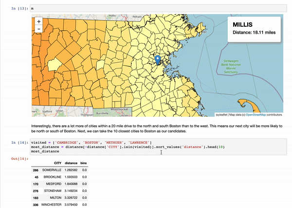
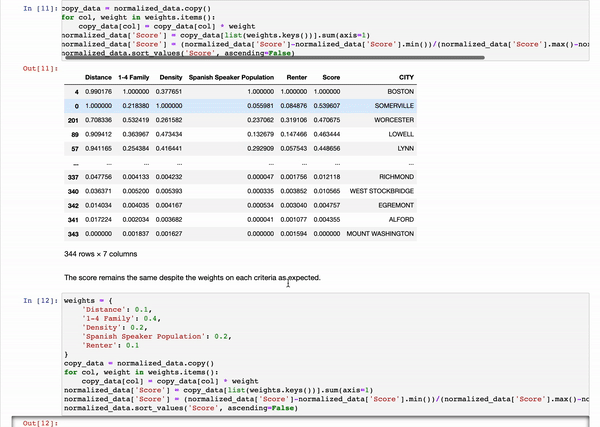

# Gyro: Using Data Analysis for The Good

 In order to contribute to a more inclusive sustainable energy program in Massachusetts, this project is part of my work for nonprofit organization called [All In Energy](https://allinenergy.org/) and undergraduate thesis for my degree. The goal is to provide All In Energy with a data-driven recommendation for its expansion in the incoming year, 2021. The project consists of Data scrapping & cleaning, Exploratory Data Analysis, and interactive Data visualization. For further more complete explanation, feel free to read the [Thesis Document](statics/Thesis.pdf).

-----------

## Technologies

 

-------

## Data Scrapping & Cleaning

This project mainly uses [Massachusetts Assessor Database](https://www.mass.gov/get-a-map) in order to determine statistical number from each potential cities in All In Energy's reach. Also, some US Census Data from last and this year have some statistic numbers that later would be used.

-------

## Exploratory Data Analysis

In order to get the sense of the data, EDA is an important process to achieve a solid recommendation. In the process, several data visualization is present with  interactive maps for exploration purposes. [Here is the HTML version of the notebook](statics/analysis.html). However, the interactive maps cannot be compiled there. Here is the [Live Jupyter Notebook](https://jupyter.jimmyganteng.com/notebooks/work/marlboroplan/analysis.ipynb).

-------

## Deployment

Named after the gyroscope effect (and also the food), Gyro, is the deliverable of the project which later handed to All In Energy. Due to the nature of Jupyter Notebook's widgets,  the Notebook needs to be served live. That is why the notebook is hosted on my old PC in my my room back home in Indonesia. This method is chosen to save some operational cost and also learning purposes. [Here is the HTML version of the notebook](statics/Gyro.html). However, the interactive maps cannot be compiled there. Here is the [Live Jupyter Notebook](https://jupyter.jimmyganteng.com/notebooks/work/marlboroplan/Gyro.ipynb).